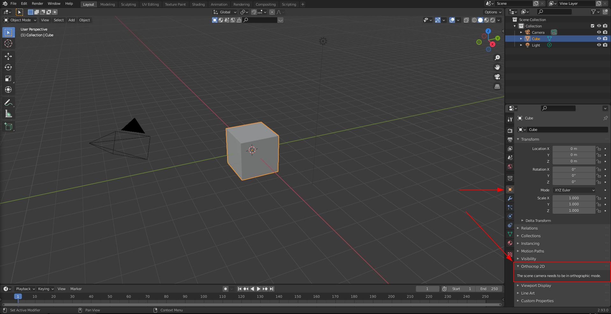
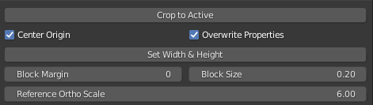
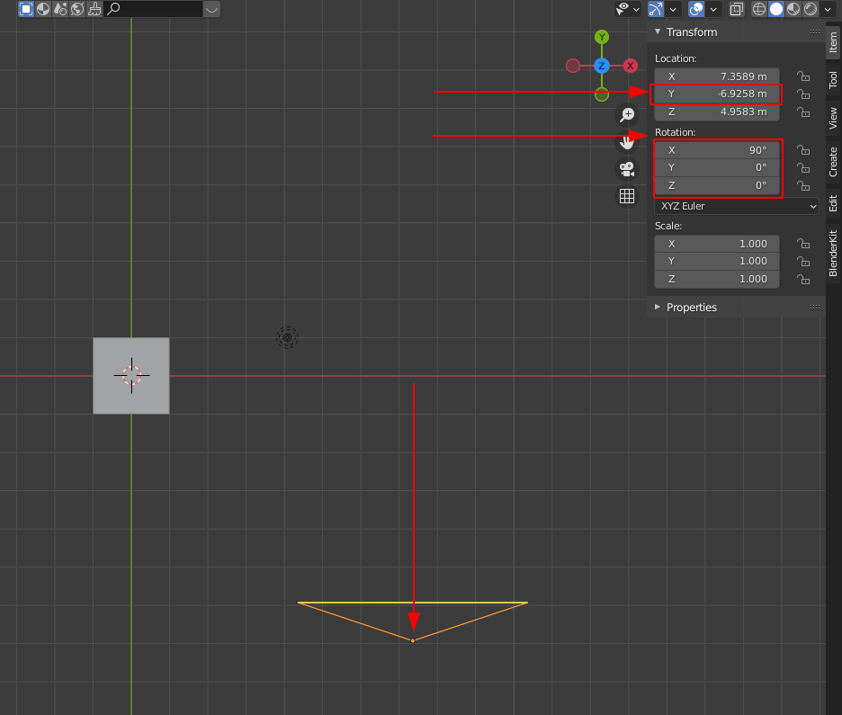
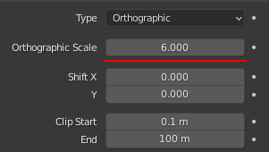
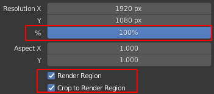
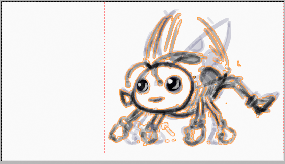
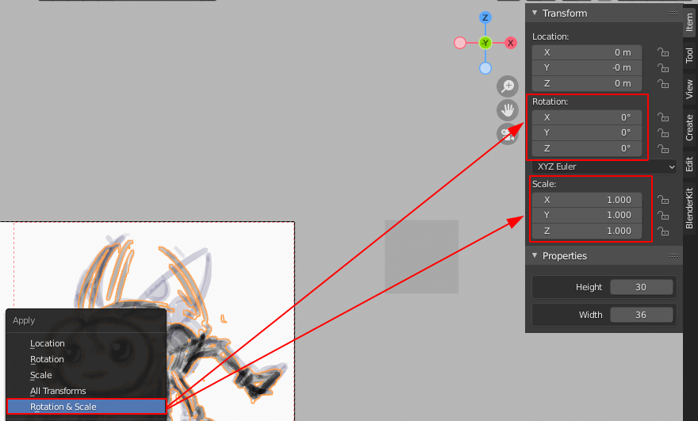

# Orthocrop 2D - Blender Add-on

Orthocrop 2D is a simple Blender addon, which helps export 2D images created with Blenders grease pencil tool, by moving and cropping the main camera onto the active object.

## Usage
[comment]: <> (
    Preperation- Camera Type- Orthographic Rotation -> x = 90° y = 0         z = 0 Location = -y in relation to the object -> object on y= 0 camera on -y The Camera should be looking towards positive Y Make sure that in Output properties render region and crop to render region are enabled. explain orthographic scale and unit size Decide on unit size-> From Full resolution get 32x32px for example
Or Decide on reference scale based on resolution 1920-> get smallest block size)

Orthocrop can be found in the "Object Properties" tab. For it to appear one has to have an orthographic camera as the scene's main camera.

When active it looks something like this:

* "Crop to Active"  : Moves the camera to the active object and sets cropbox.
* "Center Origin"   : Centers the objects origin to the bounding box's center.
* "Overwrite Properties": Recalculate already set width and height. 
* "Block Margin": A margin around the object within the cropbox.
* "Block Size": Block size in Blender units.
* "Reference Ortho Scale": Orthographic scale in which objects are at full resolution.

### Setup
In order to properly use this addon you have to meet some prerequisites.

* Camera properties:
    - Make sure the camera is an orthographic camera.
        - Be aware of your "Orthographic Scale" for later use. 
    - Make sure the camera is looking towards positive y.
    

* Render settings:
    - Render Region must be enabled
    - Crop to Render Region must be enabled

**Warning:** Orthocrop sets the resolution % based on reference orthographic scale and the current cameras orthographic scale. Make sure to that the resolution % is correct before rendering in order to avoid problems.

With all of this out of the way, you are set!

#### Approaches
The tool can be used to get different results based on what your goals are. 
For pixel based tile sizes you can take the tile and blocksize approch in which you can calculate set your tile and blocksize in order to stay consistent in pixels througout all renders.

The Relative approach lets you stay consistent by sticking to a reference object placed in viewspace. This is the simpler approach and only the reference orthographic scale has to be set once in oder to keep consistent renders.

Both can utilize a per object margin, which is given in blocks for ease of use. 

##### Tilesize & Blocksize

Decide on tile size or calculate the rest.
Formula to decide resolution: 

| variable | description|
|:---:|:---:|
|b |Block size|
|t |Tile size in px|
|S |Reference orthographic scale|
|X |Resolution on largest axis in px| 
##### Relative to Resolution 

When setting up the camera just make sure that its ortho scale is the same as the refernce orthoscale. This way you can choose any resolution and scale your objects accordingly. 

As long as "Reference Orthoscale" represents the full view, and therefore resolution, you can change the cameras orthoscale as you please. 

### Workflow
After everything is properly setup, any new object just needs to have width and height calculated by pressing 'Set Width and Height' and then just press 'Crop to Active' if you wish to render the object. If the objects dimensions do not change within any frame you do not need to recalculate the width and height. 

If changes have been applied to the object, or grease pencil animation you can recalculate the bounding box by having "Overwrite Properties" selected.

The camera will move onto the object like shown here on the left. On the right the render result within the box is visible. 

Note: For greasepencil objects all frames are taken into account in order to guarantee that the objects stay in frame.

If the bounding box does not seem correct, make sure that you have applied the scale and rotation on the object.

You can also crop to non grease pencil objects like this basic cube right here! 

## License
[GPL-3.0](LICENSE)
